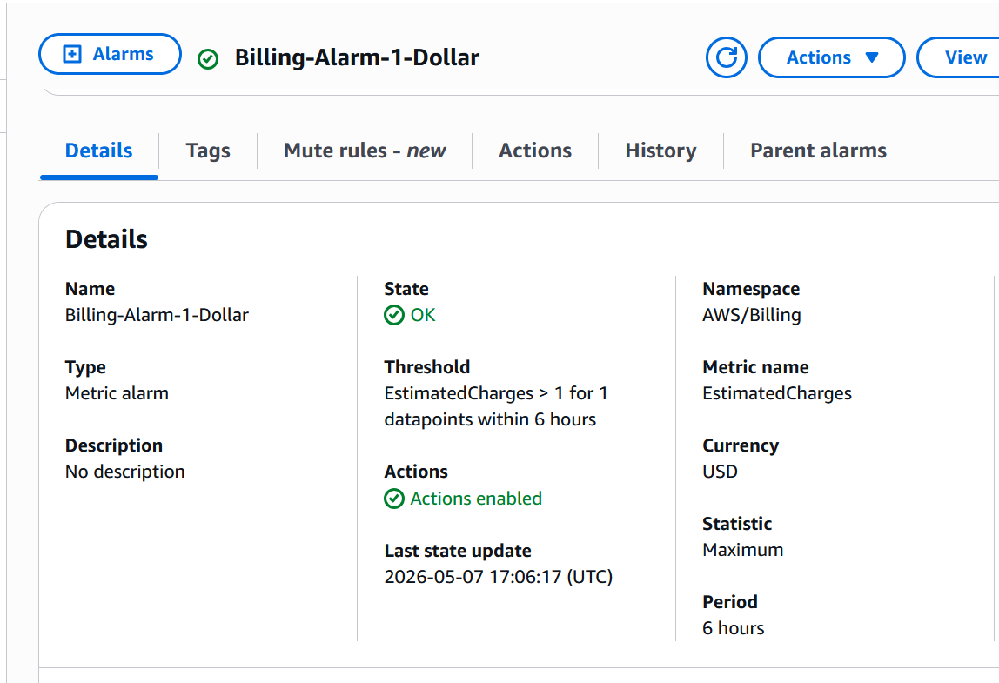
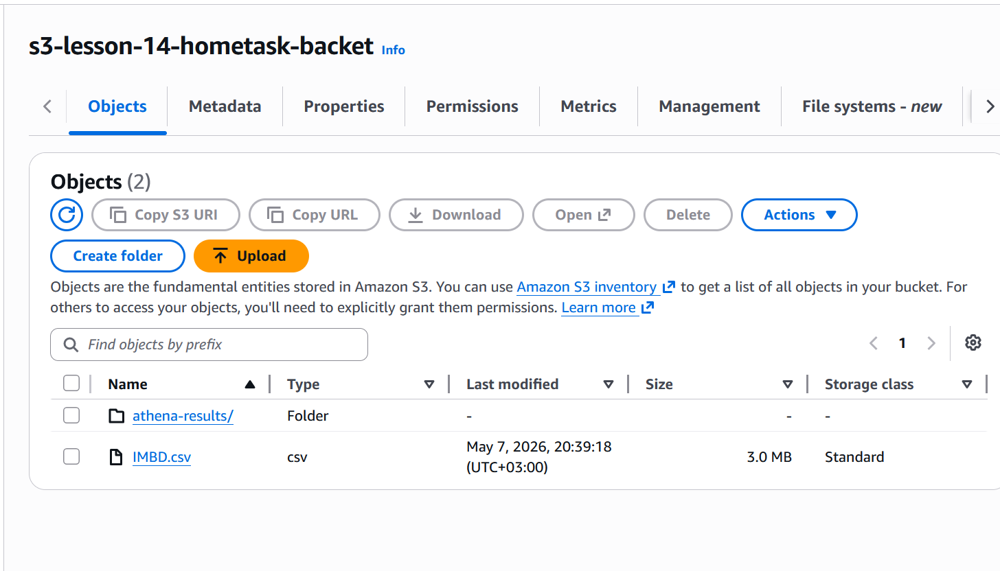
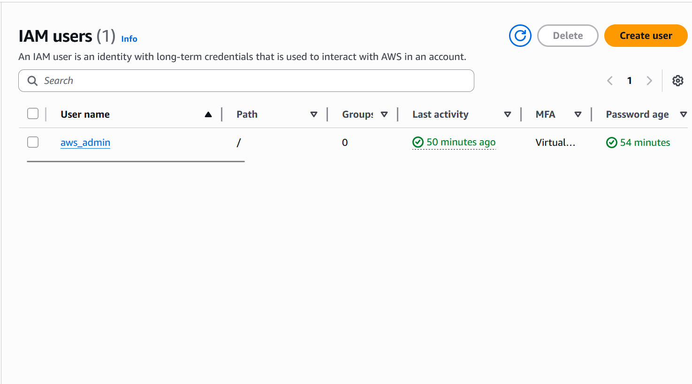
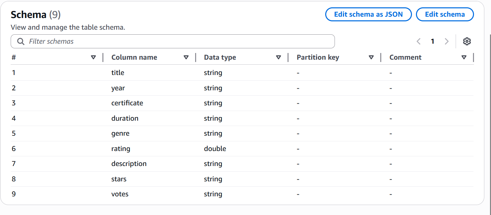
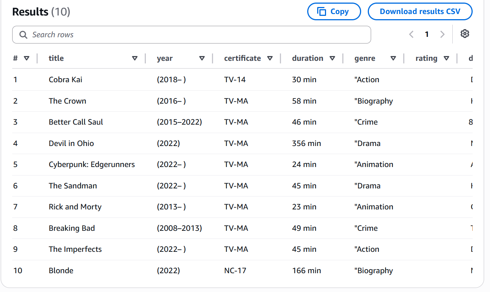

# Виконання домашнього завдання: Перший Data Pipeline в AWS 

## 1. Активний аларм у CloudWatch
**Вимога:** Активний аларм у CloudWatch на суму $1

---

## 2. Зберігання даних: Amazon S3
**Вимога:** Скріншот завантаженого файлу у S3 Бакет (IMBD.csv).

---

## 3. Користувачі в IAM
**Вимога:** Список користувачів у ІАМ (має бути видно створеного адміна). Root-акаунт не використовується.

## 4. AWS Glue Catalog
**Вимога:** Таблиця у Glue Catalog, яку створив кравлер (має бути видно структуру колонок та типів даних).

---

## 5. Аналітика: Amazon Athena
**Вимога:** Вікно результатів Athena з даними, які ви дістали з файлу.

