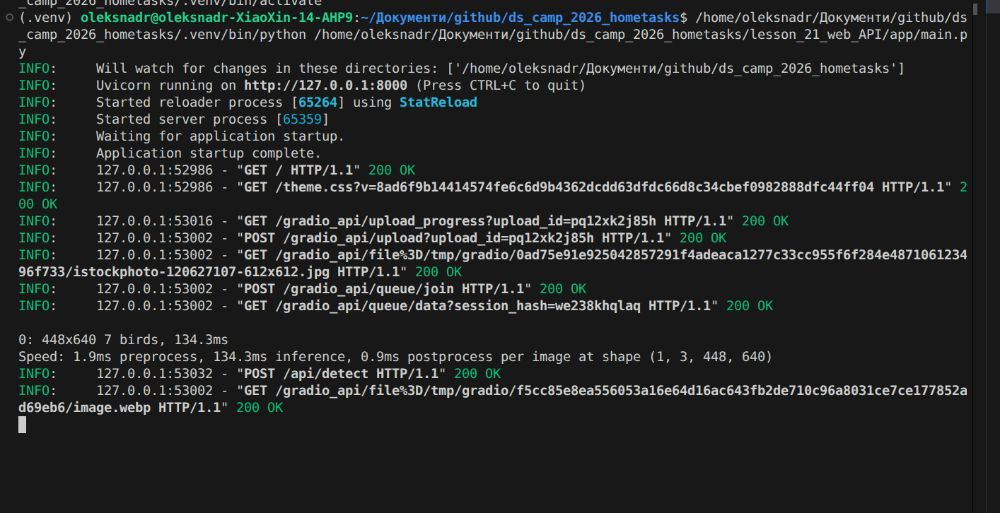
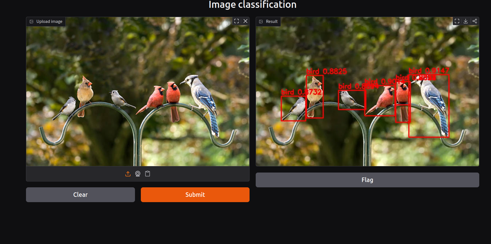

# YOLOv8 Object Detection API

## Overview

This project provides an object detection service built on top of the
**YOLOv8** model (via the `ultralytics` library). It exposes:

- A **REST API endpoint** (`/api/detect`) that accepts an image and returns
  detected objects with their class names, confidence scores, and bounding
  boxes.
- A **Gradio web interface** mounted at the root path (`/`) that allows users
  to upload an image through a browser, sends it to the API endpoint, and
  displays the image with detected objects drawn on top.

Both the API and the UI run within a single FastAPI application, served by
Uvicorn.

## Deployment info

- The application is served using **Uvicorn** (ASGI server).
- FastAPI hosts the REST API, and the Gradio interface is mounted on the
  same FastAPI app using `gr.mount_gradio_app`.
- Default host/port: `127.0.0.1:8000`.
- The Gradio UI calls the API endpoint internally via an HTTP request to
  `http://127.0.0.1:8000/api/detect`, so both components run in the same
  process and share the same port.
- `reload=True` is enabled for development; disable it for production
  deployments.

To run the application:

```bash
python main.py
```

The application will be available at:

- Web UI: `http://localhost:8000/`
- API endpoint: `http://localhost:8000/api/detect`

## Installation instructions

1. (Recommended) Create and activate a virtual environment:

```bash
python -m venv .venv
source .venv/bin/activate   # on Linux/macOS
.venv\Scripts\activate      # on Windows
```

2. Install the dependencies from `requirements.txt`:

```bash
pip install -r requirements.txt
```

3. Run the application:

```bash
python main.py
```

### requirements.txt

```
fastapi
uvicorn
gradio
requests
numpy
opencv-python
pillow
ultralytics
python-multipart
```

## Modeling info

- **Model:** YOLOv8 (medium variant, `yolov8m.pt`), loaded via the
  `ultralytics.YOLO` class.
- **Task:** Object detection — the model identifies objects in an image,
  returning their class label, confidence score, and bounding box
  coordinates (`x1, y1, x2, y2`).
- **Input:** RGB image (converted internally from uploaded image bytes
  using `PIL.Image`).
- **Output:** A list of detections, each containing:
  - `class` — predicted object class name
  - `confidence` — detection confidence score (rounded to 4 decimals)
  - `bbox` — bounding box coordinates `[x1, y1, x2, y2]` (rounded to 1
    decimal)
- The model is loaded once at application startup and reused for all
  requests (no per-request model loading).

## Interface description

### 1. `POST /api/detect`

REST API endpoint for object detection.

- **Input:**
  - `file` (multipart/form-data) — an image file (`Content-Type` must start
    with `image/`, e.g. `image/jpeg`, `image/png`).

- **Output (JSON):**
  ```json
  {
    "filename": "example.jpg",
    "objects_found": 3,
    "detections": [
      {
        "class": "person",
        "confidence": 0.9123,
        "bbox": [34.5, 12.0, 220.3, 410.7]
      },
      ...
    ]
  }
  ```

- **Errors:**
  - `400 Bad Request` — if the uploaded file is not an image.
  - `500 Internal Server Error` — if an error occurs during inference.

- **Functionality:** Accepts an uploaded image, runs YOLOv8 inference on it,
  and returns a structured list of detected objects with their class,
  confidence score, and bounding box coordinates.

### 2. Gradio interface (`/`) — `predict_via_api`

Interactive web UI.

- **Input:** An image uploaded by the user through the Gradio `Image`
  component (received as a `numpy.ndarray`).

- **Output:** An image (`numpy.ndarray`) with bounding boxes and labels
  (class name + confidence score) drawn on top of detected objects.

- **Functionality:**
  1. Converts the uploaded image to bytes and
     request to the `/api/detect` endpoint.
  2. Receives the detection results (class, confidence, bounding box) in
     JSON format.
  3. Draws bounding boxes and labels on a copy of the original image using
     OpenCV.
  4. Returns the annotated image to be displayed in the Gradio UI.


## Example of processes

 
### 1. Server logs (Uvicorn console)
 
Shows the incoming HTTP request from the Gradio UI to the `/api/detect`
endpoint.
 

 
### 2. Gradio UI result
 
Uploaded image and the resulting image with detected objects (bounding
boxes and class labels).
 

 
 
 
