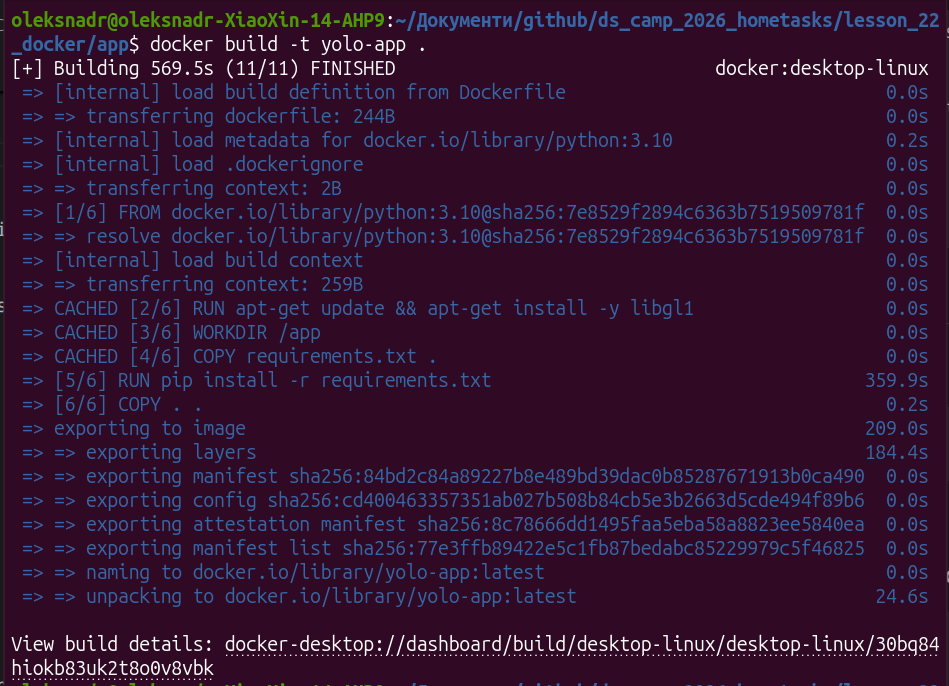
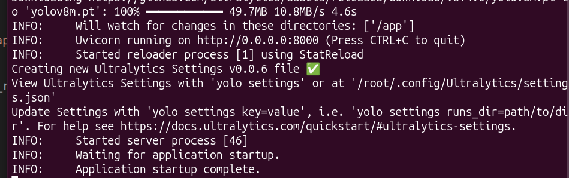
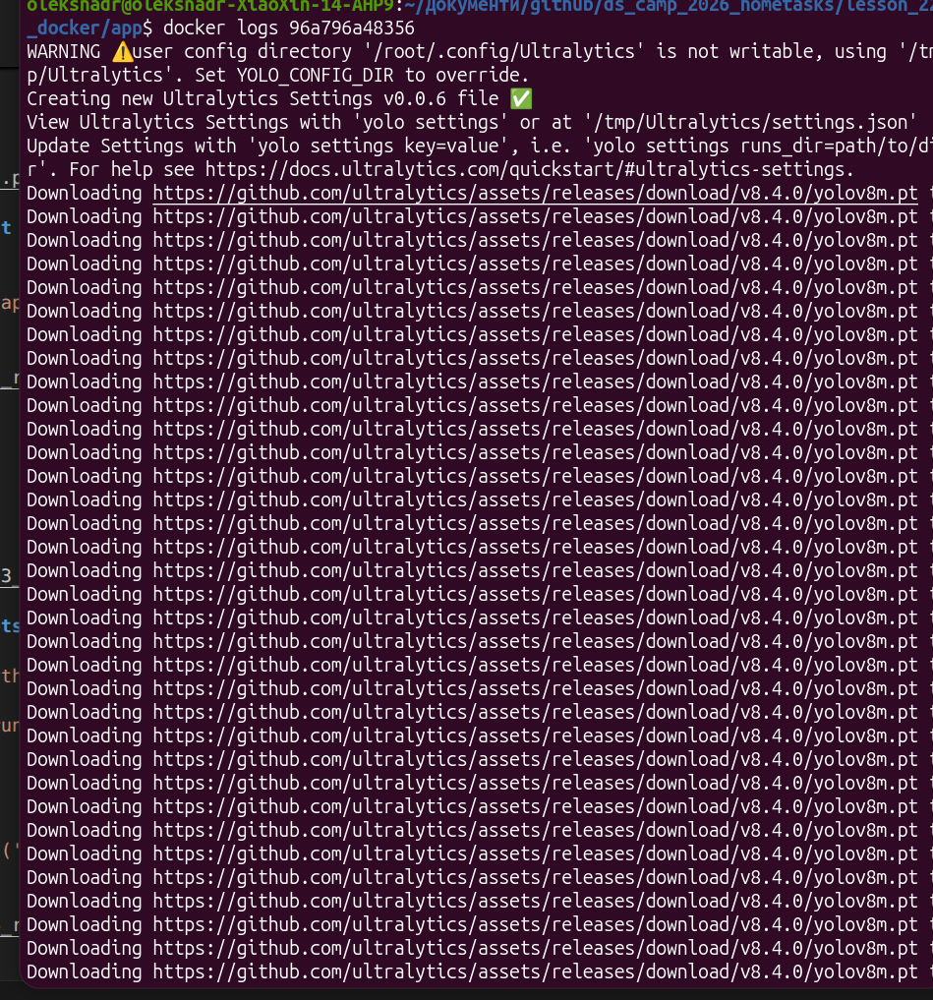
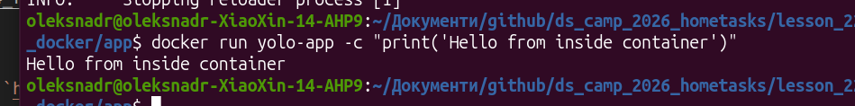
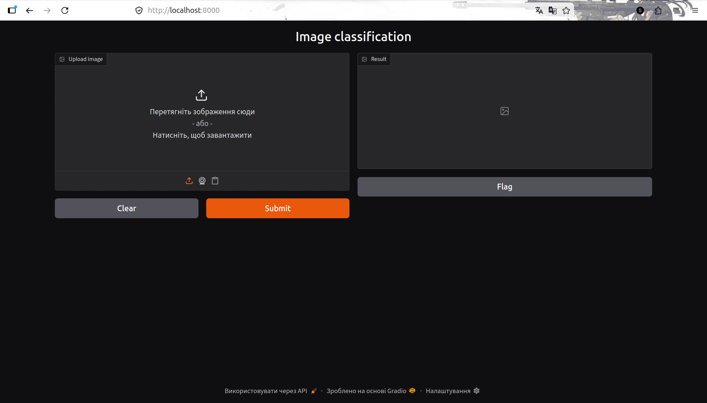
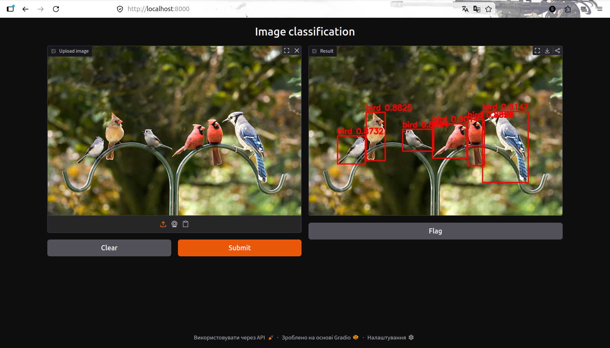

# Docker Deployment

## 1. Overview

This project is a YOLOv8-based object detection service, deployed as a
Docker container. It exposes a FastAPI endpoint (`/api/detect`) and a
Gradio web interface for image upload and visualization of detection
results.


## 2. Dockerfile

```dockerfile
FROM python:3.10
RUN apt-get update && apt-get install -y libgl1
WORKDIR /app
COPY requirements.txt .
RUN pip install -r requirements.txt
COPY . .
EXPOSE 8000
ENTRYPOINT ["python3"]
CMD ["main.py"]
```

## 3. Build and run

### Build the image

```bash
docker build -t yolo-app .
```



### Run the container (default command)

```bash
docker run -p 8000:8000 yolo-app
```



### Container startup logs

```bash
docker logs <container_id>
```



## 4. Running arbitrary scripts via ENTRYPOINT/CMD

Because `ENTRYPOINT` is `["python3"]` and `CMD` is `["main.py"]`, any
arguments passed to `docker run` replace `CMD` and are executed by
`python3`:

```bash
docker run yolo-app -c "print('Hello from inside container')"
```



## 5. Web interface
 
Open the app in a browser at `http://localhost:8000/`:
 

 
### Detection result example
 

